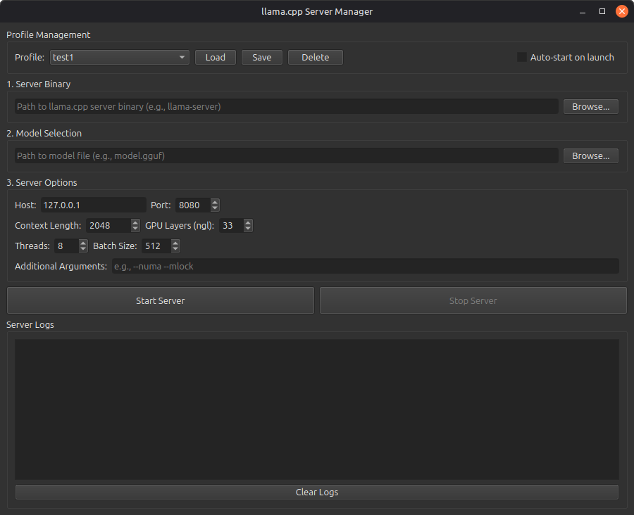

# llama.cpp Server GUI

A professional PyQt6-based graphical interface for managing llama.cpp server instances.



## Features

- **Server Binary Selection**: Browse and select your llama.cpp server binary
- **Model Selection**: Easy selection of GGUF model files
- **Comprehensive Options**: Configure host, port, context length, GPU layers, threads, batch size, and more
- **Start/Stop Controls**: Simple buttons to start and stop the server
- **Real-time Logs**: View server output and errors in real-time
- **Profile Management**: Save and load different configurations for different models/use cases
- **Configuration Persistence**: All settings are saved between sessions
- **System Tray Icon**: Minimize to tray to keep the server running in the background
- **Auto-start**: Option to automatically start the server when the GUI launches

## Requirements

- Python 3
- PyQt6
- llama.cpp server binary

## Installation

1. Install PyQt6:
```bash
sudo apt install python3-pyqt6
```

2. Make sure you have llama.cpp compiled with the server binary

## Usage

Run the application:
```bash
./llama_server_gui.py
```

Or:
```bash
python3 llama_server_gui.py
```

## Quick Start

1. **Select Server Binary**: Click "Browse..." in the "Server Binary" section and navigate to your llama.cpp server binary (e.g., `/home/xero110/dev/llama.cpp/build/bin/llama-server`)

2. **Select Model**: Click "Browse..." in the "Model Selection" section and choose your GGUF model file

3. **Configure Options**: Adjust the server options as needed:
   - Host: IP address to bind to (default: 127.0.0.1)
   - Port: Port number (default: 8080)
   - Context Length: Maximum context size (default: 2048)
   - GPU Layers (ngl): Number of layers to offload to GPU (default: 33)
   - Threads: CPU threads to use (default: 8)
   - Batch Size: Batch size for processing (default: 512)
   - Additional Arguments: Any extra command-line arguments

4. **Start Server**: Click "Start Server"

5. **Save Profile**: Once you have a configuration you like, click "Save Profile" to save it for later use

## Profile Management

- **Save Profile**: Saves the current configuration with a custom name
- **Load Profile**: Select a profile from the dropdown and click "Load" to load its settings (profiles also auto-load when selected from dropdown)
- **Delete Profile**: Removes the selected profile
- **Auto-start**: Check this option to automatically start the server when the GUI launches

The GUI now includes detailed logging in the log viewer at the bottom, showing when profiles are saved, loaded, and what settings are being applied.

## System Tray

The application includes a system tray icon that allows you to:
- Show/hide the main window
- Start/stop the server from the tray menu
- Quit the application

When you close the window while the server is running, you can choose to:
- Minimize to tray (server keeps running)
- Stop server and quit
- Cancel the close operation

## Configuration File

Settings are stored in `~/.llama_server_gui_config.json`

## Common Server Options Explained

- **Context Length (-c)**: Maximum number of tokens the model can process at once. Larger values use more RAM/VRAM.
- **GPU Layers (-ngl)**: Number of model layers to offload to GPU. Higher = faster but uses more VRAM. Set to -1 for all layers.
- **Threads (-t)**: Number of CPU threads for processing. Usually set to your CPU core count or less.
- **Batch Size (-b)**: Number of tokens processed in parallel. Larger = faster but uses more memory.
- **Host**: Network interface to bind to. Use 127.0.0.1 for local-only access, or 0.0.0.0 to allow network access.
- **Port**: Network port for the server API.

## Tips

- For RTX 4070 (8GB VRAM): Start with ngl=33 and adjust based on your model size
- With 96GB RAM and i9 CPU: You can use high thread counts (16-24) and large context sizes
- Create different profiles for different models (e.g., "Llama-3-8B", "Mistral-7B", etc.)
- Use the system tray to keep the server running while working on other tasks

## Troubleshooting

**Server won't start:**
- Check that the binary path is correct and the file is executable
- Verify the model path is correct
- Check the logs for error messages

**Out of memory errors:**
- Reduce context length
- Reduce GPU layers (ngl)
- Use a smaller model

**Slow performance:**
- Increase GPU layers if you have VRAM available
- Adjust thread count
- Increase batch size (if you have memory available)
